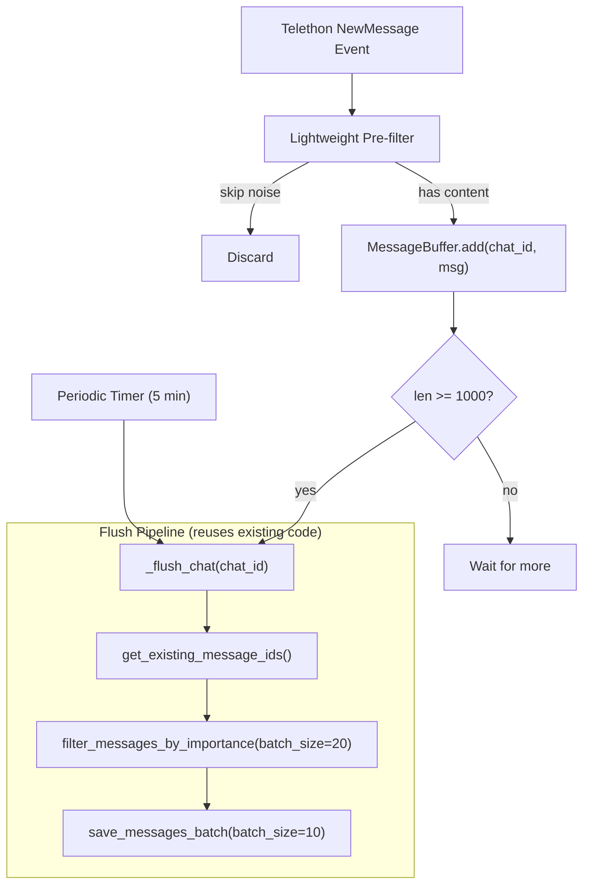

# Feature: Real-time Message Ingestion with Buffered Flush

## Overview

Replace the current batch scraping approach (`client.iter_messages` run manually) with Telethon real-time event handlers that continuously listen for new messages. An in-memory `MessageBuffer` accumulates messages per chat and flushes them through the existing pipeline (dedup → AI filter → save with embeddings) once a threshold or timer is reached. This keeps the knowledge base fresh without manual scraper runs, while staying 10-20x cheaper than processing every message individually through the AI filter.

## Problem Statement

The current scraper in `scripts/data_scraper/main.py` runs as a one-shot batch job:

```
asyncio.run(main())  →  for chat_id in CHAT_IDS: scrape_channel(...)
```

This has several limitations:

- **Stale data** — New messages are only indexed when someone manually runs the scraper. The bot can't answer questions about recent activity.
- **All-or-nothing** — Each run fetches the entire history (or from a `max_id` checkpoint), which is slow and wastes Telegram API calls on messages already processed.
- **No continuous operation** — There's no long-running process that keeps the knowledge base up to date in the background.

Real-time event handlers solve these issues, but naively calling the AI filter on every single incoming message would be:

- **Expensive** — A GPT-4o-mini call for every message across 5+ chats adds up fast.
- **Inefficient** — The AI filter works better with batches because it can see message context (reply chains, conversation flow).
- **Wasteful** — Many messages in a batch get filtered out anyway; paying per-message for that filtering is unnecessary.

## Solution: Buffered Real-time Ingestion

### Architecture




### MessageBuffer Class

The core component — an async-safe in-memory buffer with per-chat message lists, a configurable flush threshold, and a periodic background flush for low-traffic chats.

```python
from collections import defaultdict
from telethon import events
import asyncio
import re


class MessageBuffer:
	def __init__(self, flush_threshold: int = 1000, e: int = 300):
		self.buffer: dict[int, list[dict]] = defaultdict(list)
		self.flush_threshold = flush_threshold
		self.flush_interval = flush_interval_seconds
		self.lock = asyncio.Lock()

	async def add(self, chat_id: int, message: dict):
		async with self.lock:
			self.buffer[chat_id].append(message)

			if len(self.buffer[chat_id]) >= self.flush_threshold:
				await self._flush_chat(chat_id)

	async def _flush_chat(self, chat_id: int):
		"""Process and save buffered messages for a chat."""
		messages = self.buffer[chat_id]
		self.buffer[chat_id] = []

		if not messages:
			return

		existing_ids = get_existing_message_ids(chat_id)
		new_messages = [m for m in messages if m["id"] not in existing_ids]
		valuable = filter_messages_by_importance(new_messages, batch_size=20)
		save_messages_batch(valuable, batch_size=10)

	async def periodic_flush(self):
		"""Background task to flush all buffers periodically."""
		while True:
			await asyncio.sleep(self.flush_interval)
			async with self.lock:
				for chat_id in list(self.buffer.keys()):
					if self.buffer[chat_id]:
						await self._flush_chat(chat_id)
```

### Telethon Event Handler

Wires the buffer into Telethon's real-time message stream:

```python
buffer = MessageBuffer(flush_threshold=1000, flush_interval_seconds=300)

@client.on(events.NewMessage(chats=CHAT_IDS))
async def handler(event):
	msg = event.message
	if msg.text and msg.text.strip() and should_buffer(msg.text):
		raw_id = str(abs(event.chat_id))
		if raw_id.startswith("100"):
			raw_id = raw_id[3:]

		await buffer.add(
			chat_id=abs(event.chat_id),
			message={
				"id": msg.id,
				"chat_id": abs(event.chat_id),
				"author": msg.sender_id,
				"text": msg.text,
				"link": f"https://t.me/c/{raw_id}/{msg.id}",
				"reply_to_message_id": msg.reply_to_msg_id,
			}
		)

# Start periodic flush in background
asyncio.create_task(buffer.periodic_flush())
```

The message dict matches the existing structure used throughout `scripts/data_scraper/` — same keys as `fetch_channel_messages.py` produces.

### Lightweight Pre-filter

A cheap local filter that runs before messages enter the buffer, discarding obvious noise so the AI filter receives less junk:

```python
SKIP_PATTERNS = [
	r"^(да|нет|ок|спс|👍|😂)$",  # Single reactions
	r"^@\w+$",                      # Just mentions
	r"^\+$",                        # Just "+"
]

def should_buffer(text: str) -> bool:
	if len(text) < 3:
		return False
	for pattern in SKIP_PATTERNS:
		if re.match(pattern, text, re.IGNORECASE):
			return False
	return True
```

This is intentionally conservative — only filters messages that are unambiguously noise. All importance decisions for borderline messages remain with the AI filter.

## Cost Analysis


| Approach                          | AI Calls   | Tokens (approx) |
| --------------------------------- | ---------- | --------------- |
| Real-time (per message)           | 1000 calls | ~500K tokens    |
| Batched (1000 → 50 batches of 20) | 50 calls   | ~50K tokens     |


The batched approach is roughly **10-20x cheaper** and actually produces better results because the AI can see message context (reply chains, conversation flow) within each batch.

## Key Design Decisions


| Aspect           | Decision                      | Rationale                                                                            |
| ---------------- | ----------------------------- | ------------------------------------------------------------------------------------ |
| Flush threshold  | 1000 messages per chat        | Balances cost efficiency with data freshness; large enough for meaningful AI batches |
| Time-based flush | Every 5 minutes               | Ensures low-traffic chats don't sit in the buffer indefinitely                       |
| Per-chat buffers | Separate `list` per `chat_id` | One busy chat doesn't delay or block others from being flushed                       |
| Pre-filter       | Local regex, < 3 chars        | Filters obvious noise cheaply; conservative to avoid losing valuable short replies   |
| Concurrency      | `asyncio.Lock` on buffer      | Prevents race conditions between the event handler and periodic flush                |
| Fail-open        | Keep all messages on AI error | Matches existing behavior in `filter_messages_by_importance`                         |


## Integration with Existing Pipeline

The `_flush_chat` method reuses the exact same functions the batch scraper calls in `scrape_channel.py`:

1. `**get_existing_message_ids(chat_id)`** — Query Supabase for IDs already in `messages` table to skip duplicates (batched queries of 1000).
2. `**filter_messages_by_importance(messages, batch_size=20)**` — Send batches of 20 messages to GPT-4o-mini with reply chain context. Auto-expands kept set to preserve complete reply threads.
3. `**save_messages_batch(valuable, batch_size=10)**` — Generate embeddings via `text-embedding-3-small`, upsert into `messages` table with composite PK `(id, chat_id)`.

No changes to these existing functions are needed. The buffer simply acts as a new entry point that collects messages and calls the pipeline when ready.

## New Files


| File                                           | Description                                                     |
| ---------------------------------------------- | --------------------------------------------------------------- |
| `scripts/realtime_ingestion/message_buffer.py` | `MessageBuffer` class with add, flush, and periodic flush logic |
| `scripts/realtime_ingestion/pre_filter.py`     | `should_buffer()` local noise filter                            |
| `scripts/realtime_ingestion/main.py`           | Entry point: starts Telethon client with event handler + buffer |
| `scripts/realtime_ingestion/__init__.py`       | Package exports                                                 |


## Open Questions / Future Work

- **Buffer persistence** — The in-memory buffer is lost on process restart. For production reliability, consider persisting the buffer to Redis or SQLite so unprocessed messages survive crashes. A simple approach: write buffer contents to a JSON file on graceful shutdown and reload on startup.
- **Question backfill integration** — Currently question generation runs as a separate backfill script (`scripts/backfill_questions/`). The flush pipeline could trigger question generation for newly saved messages, or a separate watcher could poll for messages without questions.
- **Graceful shutdown** — On `SIGTERM`/`SIGINT`, flush all remaining buffers before exiting to avoid data loss.
- **Monitoring** — Log buffer sizes, flush frequency, and AI filter ratios to track health. Could emit to the existing `bot_interactions` table or a new metrics table.
- **Dynamic threshold** — Adjust flush threshold based on chat activity. Very active chats could flush at 500; quiet chats rely on the time-based flush.

